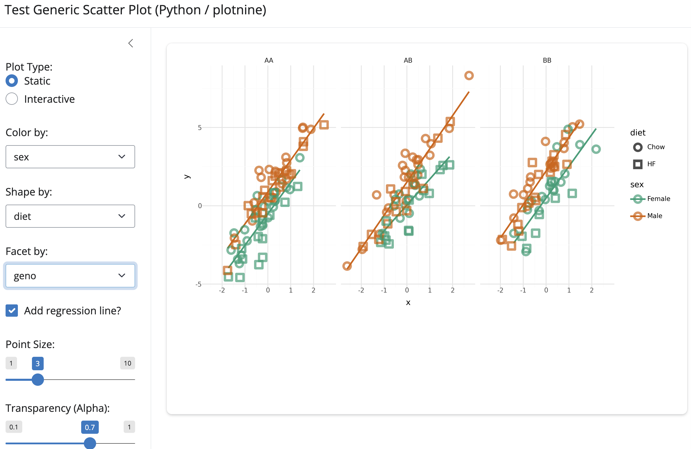

# scattyr: Generic Scatter Plots in R & Python

[](https://byandell.github.io/scattyr/)
[](https://www.r-project.org/)
[](https://www.python.org/)

**scattyr** is a unified framework providing modular, reactive generic scatter plot applications built with **R (`ggplot2` + `bslib` / `shiny`)** and **Python (`plotnine` + `shiny` / `shinywidgets`)**.

---

## 🎨 Demo Cards

| R / Shiny Scatter Plot | Python / plotnine Scatter Plot |
| :---: | :---: |
| [](demos/r_scatter_app.html) | [](demos/python_scatter_app.html) |
| **Interactive Shinylive Demo:** [R Scatter App](demos/r_scatter_app.html) | **Interactive Shinylive Demo:** [Python Scatter App](demos/python_scatter_app.html) |
| **App Source:** [`scatterPlotApp.R`](scatterPlotApp.R) | **App Source:** [`scatter_plot_app.py`](scatter_plot_app.py) |
| **Core Function:** [`scatter_ggplot()`](scatter.R) | **Core Function:** [`scatter_plotnine()`](scatter.py) |
| Open circle symbols (`shape = 1`), Dark2 palette, dynamic faceting | Open symbols (`fill = "none"`, `stroke = 1.5`), plotnine grammar |

---

## 🚀 Quick Start

### 1. R Scatter Plot App

#### From Shell
```bash
Rscript -e 'source("scatterPlotApp.R"); scatterPlotApp()'
```

#### From R / Quarto (`.qmd`) code block
```r
source("scatterPlotApp.R")
scatterPlotApp()
```

---

### 2. Python Scatter Plot App

#### From Shell
```bash
shiny run scatter_plot_app.py
```

#### From Python / Quarto (`.qmd`) code block
```python
from scatter_plot_app import app
app.run()
```

---

## 📂 Repository Structure

- [`scatter.R`](scatter.R): Contains `scatter_ggplot()` extracted plotting logic and Roxygen2 documentation.
- [`scatterPlotApp.R`](scatterPlotApp.R): R Shiny application module (`scatterPlotApp`, `scatterPlotServer`, `scatterPlotInput`, `scatterPlotOutput`).
- [`theme.R`](theme.R): Theme configuration functions (`scattyr_theme()`, `scattyr_plot_theme()`).
- [`scatter.py`](scatter.py): Python plotting library function `scatter_plotnine()` using `plotnine`.
- [`scatter_plot_app.py`](scatter_plot_app.py): Shiny for Python application module.
- [`demos/index.qmd`](demos/index.qmd): Quarto Shinylive interactive Demos Gallery listing page.
- [`walkthrough.md`](walkthrough.md): Comprehensive refactoring and development walkthrough.

---

## 📄 License

MIT License. See [LICENSE](LICENSE) for details.
